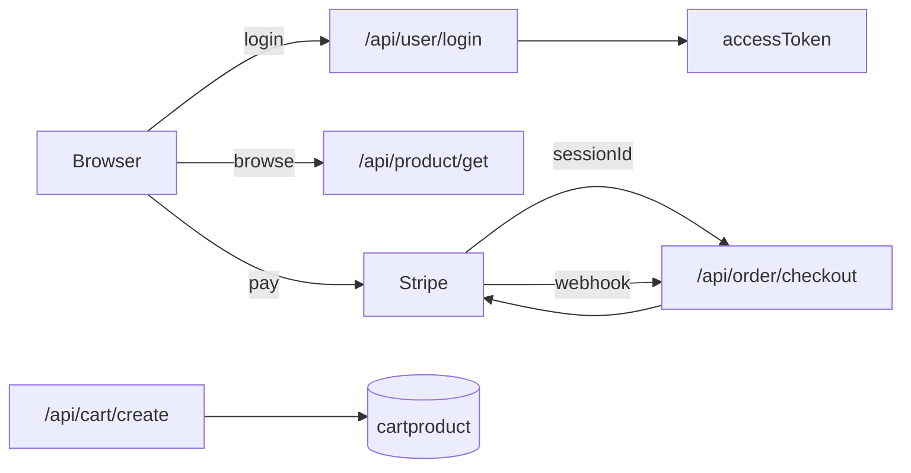

# Client-Side Structure

## Layout.jsx  
The **root layout** for the React app. It:  
- Wraps pages with a consistent **Header** and **Footer**.  
- Uses React Router’s `<Outlet/>` for nested routes.  
- Fetches user, categories, and subcategories on mount.  
- Provides global state via **GlobalProvider**.  
```js
// Fetches current user, categories, subcategories
useEffect(()=>{
  fetchUser()
  fetchCategory()
  fetchSubCategory()
},[])
```  


## AdminPermission.jsx  
Guards admin-only views. It:  
- Reads `user.role` from Redux.  
- Renders `children` if role is **ADMIN**, else shows a “no permission” message.  
```jsx
{ isAdmin(user.role) ? children : <p className="text-red-600">No Permission</p> }
```  


## Dashboard.jsx  
Defines the **dashboard layout**. It:  
- Splits screen into a sidebar (**UserMenu**) and content (`<Outlet/>`).  
- Sidebar is sticky and only visible on larger screens.  
```jsx
<div className="grid grid-cols-[200px_1fr]">…<UserMenu/>…<Outlet/>…</div>
```  


---

# Redux Store

## store.js  
Configures Redux with four slices:  
- **user**: current user details.  
- **product**: categories, subcategories, product list.  
- **cartItem**: items in cart.  
- **addresses**: saved addresses.

## userSlice.js  
Manages authentication state:  
- `setUser` updates all user properties on login/refresh.

## productSlice.js  
Handles categories and subcategories:  
- `setAllCategory`, `setAllSubCategory`, `setLoadingCategory`.

## cartProduct.js  
Tracks shopping cart contents:  
- `handleAddItemCart` replaces the cart array.

## addressSlice.js  
Stores user’s address list:  
- `handleAddAddress` replaces the address array.

---

# Client Components Overview

Each component lives in `client/src/assets/components/…` and handles UI pieces.  
Key patterns:  
- **Forms & Modals**: Add/Edit Category, Product, Address.  
- **Display**: CardProduct, CardMobile, DisplayCartItems, ProductListPage, CategoryWiseProductDisplay.  
- **Auth**: Login, Register, ForgotPassword, OTPVerify, ResetPassword, VerifyEmail.  
- **Navigation**: Header (search, cart icon), Footer, UserMenu, UserMenuMobile.

Example: **AddToCartButton.jsx**  
- Shows a button or loader based on `loading` state.  
- Calls `SummaryAPI.addTocart` via Axios on click.  


---

# Client Utilities & API Summary

## common/SummaryAPI.js  
Centralizes all backend endpoints and HTTP methods. Example entries:  
| Key                       | URL                                      | Method |
|---------------------------|------------------------------------------|--------|
| `login`                   | `/api/user/login`                        | POST   |
| `getCartItem`             | `/api/cart/get`                          | GET    |
| `createAddress`           | `/api/address/create`                    | POST   |
| `payment_url`             | `/api/order/checkout`                    | POST   |  


## utils/Axios.js  
Wraps **axios**:  
- Sets baseURL and credentials.  
- Attaches `Authorization: Bearer <token>` from `localStorage`.  
- Retries once on 401 after refreshing token.

Other small utils:  
- **AxiosToastError**: displays API errors with toast.  
- **DisplayPriceInRupees**, **PriceWithDiscount**: formatting helpers.  
- **SuccessAlert**: SweetAlert2 wrapper.  
- **fetchUserDetails**: fetches `/api/user/user-details`.  
- **isAdmin**: checks role string.  
- **uploadImage**: uploads files via `/api/file/upload`.

---

# Client Routing

`client/src/routes/index.jsx` defines public and protected routes:  
- Public: `/home`, `/search`, `/login`, `/register`, `/verify-email`, `/forgot-password`, `/otp-verification`, `/reset-password`.  
- **Dashboard** (`/dashboard`) sub-routes:  
  - `/profile`, `/my-orders`, `/address` (all users).  
  - `/category`, `/sub-category`, `/upload-product`, `/product` (requires **AdminPermission**).  
- Product browsing: `/:category/:subcategory`, `/product/:product`.  
- Cart & checkout: `/cart`, `/checkout`, `/success`, `/cancel`.  


---

# Server-Side Architecture

## Configuration (`server/config`)  
- **connectDB.js**: connects to MongoDB via MONGODB_URI.  
- **sendEmail.js**: uses Resend API to send templated emails.  
- **stripe.js**: initializes Stripe with secret key from env.

## Middleware (`server/middleware`)  
- **auth.js**: verifies JWT access token from cookie or header.  
- **Admin.js**: checks `user.role === 'ADMIN'`.  
- **multer.js**: sets up in-memory file upload.

## Models (`server/models`)  
Mongoose schemas for:  
- **User**: with email/password, avatar, role, cart IDs, address IDs, order history.  
- **Category**, **SubCategory**: simple name/image and references.  
- **Product**: with name, images, categories, subcategories, stock, price, discount, description.  
- **CartProduct**: links a product to a user with quantity.  
- **Address**: user’s saved addresses, active flag.  
- **Order**: payment and delivery details, product snapshot.

## Controllers (`server/controllers`)  
Implement business logic for each resource. Key patterns:  
- Validate input; return `{ success, error, message, data }`.  
- Use `req.userId` from **auth** middleware.  
- Populate references (e.g., cart items with product data).  
- Integrate third-party: Stripe checkout, Resend emails, Cloudinary for images.

---

# API Endpoints

<!-- Address Routes -->
```api
{
  "title": "Create Address",
  "description": "Add a new address for authenticated user",
  "method": "POST",
  "baseUrl": "http://localhost:8080",
  "endpoint": "/api/address/create",
  "headers": [
    { "key": "Authorization", "value": "Bearer <accessToken>", "required": true }
  ],
  "bodyType": "json",
  "requestBody": "{\n  \"address_line\": \"123 Main St\",\n  \"city\": \"City\",\n  \"state\": \"State\",\n  \"country\": \"Country\",\n  \"pincode\": \"123456\",\n  \"mobile\": \"9876543210\"\n}",
  "responses": {
    "200": {
      "description": "Address created",
      "body": "{ \"success\": true, \"data\": { /* address object */ } }"
    },
    "401": {
      "description": "Unauthorized",
      "body": "{ \"message\": \"Access token not found\" }"
    }
  }
}
```
```api
{
  "title": "Get Addresses",
  "description": "Fetch list of addresses for authenticated user",
  "method": "GET",
  "baseUrl": "http://localhost:8080",
  "endpoint": "/api/address/get",
  "headers": [
    { "key": "Authorization", "value": "Bearer <accessToken>", "required": true }
  ],
  "bodyType": "none",
  "responses": {
    "200": {
      "description": "List of addresses",
      "body": "{ \"success\": true, \"data\": [ /* array of addresses */ ] }"
    }
  }
}
```
```api
{
  "title": "Update Address",
  "description": "Modify an existing address",
  "method": "PUT",
  "baseUrl": "http://localhost:8080",
  "endpoint": "/api/address/update",
  "headers": [
    { "key": "Authorization", "value": "Bearer <accessToken>", "required": true }
  ],
  "bodyType": "json",
  "requestBody": "{ \"_id\": \"<addressId>\", \"city\": \"New City\", … }",
  "responses": {
    "200": { "description": "Address updated", "body": "{ \"success\": true }" }
  }
}
```
```api
{
  "title": "Disable Address",
  "description": "Soft-delete an address by setting status=false",
  "method": "DELETE",
  "baseUrl": "http://localhost:8080",
  "endpoint": "/api/address/disable",
  "headers": [
    { "key": "Authorization", "value": "Bearer <accessToken>", "required": true }
  ],
  "bodyType": "json",
  "requestBody": "{ \"_id\": \"<addressId>\" }",
  "responses": {
    "200": { "description": "Address disabled", "body": "{ \"success\": true }" }
  }
}
```
<!-- Cart Routes -->
```api
{
  "title": "Add to Cart",
  "description": "Add a product to authenticated user’s cart",
  "method": "POST",
  "baseUrl": "http://localhost:8080",
  "endpoint": "/api/cart/create",
  "headers": [
    { "key": "Authorization", "value": "Bearer <accessToken>", "required": true }
  ],
  "bodyType": "json",
  "requestBody": "{ \"productId\": \"<productId>\" }",
  "responses": {
    "200": { "description": "Item added", "body": "{ \"success\": true, \"data\": { /* cart item */ } }" }
  }
}
```
```api
{
  "title": "Get Cart Items",
  "description": "Retrieve cart items for user",
  "method": "GET",
  "baseUrl": "http://localhost:8080",
  "endpoint": "/api/cart/get",
  "headers": [
    { "key": "Authorization", "value": "Bearer <accessToken>", "required": true }
  ],
  "bodyType": "none",
  "responses": {
    "200": { "description": "Cart contents", "body": "{ \"success\": true, \"data\": [ /* items */ ] }" }
  }
}
```
```api
{
  "title": "Update Cart Quantity",
  "description": "Change quantity of a cart item",
  "method": "PUT",
  "baseUrl": "http://localhost:8080",
  "endpoint": "/api/cart/update-qty",
  "headers": [
    { "key": "Authorization", "value": "Bearer <accessToken>", "required": true }
  ],
  "bodyType": "json",
  "requestBody": "{ \"_id\": \"<cartItemId>\", \"quantity\": 2 }",
  "responses": {
    "200": { "description": "Updated quantity", "body": "{ \"success\": true }" }
  }
}
```
```api
{
  "title": "Delete Cart Item",
  "description": "Remove an item from the cart",
  "method": "DELETE",
  "baseUrl": "http://localhost:8080",
  "endpoint": "/api/cart/delete-cart-item",
  "headers": [
    { "key": "Authorization", "value": "Bearer <accessToken>", "required": true }
  ],
  "bodyType": "json",
  "requestBody": "{ \"_id\": \"<cartItemId>\" }",
  "responses": {
    "200": { "description": "Item removed", "body": "{ \"success\": true }" }
  }
}
```
<!-- Category Routes -->
```api
{
  "title": "Add Category",
  "description": "Create a new product category (admin-only)",
  "method": "POST",
  "baseUrl": "http://localhost:8080",
  "endpoint": "/api/category/add-category",
  "headers": [
    { "key": "Authorization", "value": "Bearer <accessToken>", "required": true }
  ],
  "bodyType": "json",
  "requestBody": "{ \"name\": \"Beverages\", \"image\": \"<url>\" }",
  "responses": {
    "200": { "description": "Category added", "body": "{ \"success\": true, \"data\": { /* category */ } }" }
  }
}
```
```api
{
  "title": "Get Categories",
  "description": "Fetch all categories (public)",
  "method": "GET",
  "baseUrl": "http://localhost:8080",
  "endpoint": "/api/category/get",
  "headers": [],
  "bodyType": "none",
  "responses": {
    "200": { "description": "Category list", "body": "{ \"success\": true, \"data\": [ /* cats */ ] }" }
  }
}
```
```api
{
  "title": "Update Category",
  "description": "Modify an existing category (admin-only)",
  "method": "PUT",
  "baseUrl": "http://localhost:8080",
  "endpoint": "/api/category/update",
  "headers": [
    { "key": "Authorization", "value": "Bearer <accessToken>", "required": true }
  ],
  "bodyType": "form",
  "formData": [
    { "key": "_id", "value": "catId", "required": true },
    { "key": "name", "value": "New Name", "required": true },
    { "key": "image", "value": "file", "required": false }
  ],
  "responses": {
    "200": { "description": "Updated", "body": "{ \"success\": true }" }
  }
}
```
```api
{
  "title": "Delete Category",
  "description": "Remove a category (admin-only)",
  "method": "DELETE",
  "baseUrl": "http://localhost:8080",
  "endpoint": "/api/category/delete",
  "headers": [
    { "key": "Authorization", "value": "Bearer <accessToken>", "required": true }
  ],
  "bodyType": "json",
  "requestBody": "{ \"_id\": \"catId\" }",
  "responses": {
    "200": { "description": "Deleted", "body": "{ \"success\": true }" }
  }
}
```
<!-- SubCategory Routes -->
```api
{
  "title": "Create SubCategory",
  "description": "Add a subcategory under categories (admin-only)",
  "method": "POST",
  "baseUrl": "http://localhost:8080",
  "endpoint": "/api/subcategory/create",
  "headers": [
    { "key": "Authorization", "value": "Bearer <accessToken>", "required": true }
  ],
  "bodyType": "json",
  "requestBody": "{ \"name\": \"Soft Drinks\", \"image\": \"<url>\", \"category\": [\"catId\"] }",
  "responses": {
    "200": { "description": "Added", "body": "{ \"success\": true, \"data\": {/* subcat */} }" }
  }
}
```
```api
{
  "title": "Get SubCategories",
  "description": "Fetch all subcategories (public)",
  "method": "POST",
  "baseUrl": "http://localhost:8080",
  "endpoint": "/api/subcategory/get",
  "headers": [],
  "bodyType": "none",
  "responses": {
    "200": { "description": "List", "body": "{ \"success\": true, \"data\": [ /* subcats */ ] }" }
  }
}
```
```api
{
  "title": "Update SubCategory",
  "description": "Modify subcategory (admin-only)",
  "method": "PUT",
  "baseUrl": "http://localhost:8080",
  "endpoint": "/api/subcategory/update",
  "headers": [
    { "key": "Authorization", "value": "Bearer <accessToken>", "required": true }
  ],
  "bodyType": "json",
  "requestBody": "{ \"_id\": \"subId\", \"name\": \"New Name\", … }",
  "responses": {
    "200": { "description": "Updated", "body": "{ \"success\": true }" }
  }
}
```
```api
{
  "title": "Delete SubCategory",
  "description": "Remove subcategory (admin-only)",
  "method": "DELETE",
  "baseUrl": "http://localhost:8080",
  "endpoint": "/api/subcategory/delete",
  "headers": [
    { "key": "Authorization", "value": "Bearer <accessToken>", "required": true }
  ],
  "bodyType": "json",
  "requestBody": "{ \"_id\": \"subId\" }",
  "responses": {
    "200": { "description": "Deleted", "body": "{ \"success\": true }" }
  }
}
```
<!-- Product Routes -->
```api
{
  "title": "Create Product",
  "description": "Add a new product (admin-only)",
  "method": "POST",
  "baseUrl": "http://localhost:8080",
  "endpoint": "/api/product/create",
  "headers": [
    { "key": "Authorization", "value": "Bearer <accessToken>", "required": true }
  ],
  "bodyType": "json",
  "requestBody": "{ /* name, images, category[], subcategory[], price, discount, stock… */ }",
  "responses": {
    "200": { "description": "Created", "body": "{ \"success\": true, \"data\": {/* product */} }" }
  }
}
```
```api
{
  "title": "Get Products",
  "description": "Paginated product list with search",
  "method": "POST",
  "baseUrl": "http://localhost:8080",
  "endpoint": "/api/product/get",
  "headers": [],
  "bodyType": "json",
  "requestBody": "{ \"page\":1,\"limit\":10,\"search\":\"apple\" }",
  "responses": {
    "200": { "description": "Paged data", "body": "{ \"success\": true, \"data\": [/*…*/], \"totalCount\":…, \"page\":1 }" }
  }
}
```
```api
{
  "title": "Get by Category",
  "description": "List products filtered by category",
  "method": "POST",
  "baseUrl": "http://localhost:8080",
  "endpoint": "/api/product/get-product-by-category",
  "headers": [],
  "bodyType": "json",
  "requestBody": "{ \"category\": \"catId\" }",
  "responses": {
    "200": { "success": true, "data": [ /*…*/ ] }
  }
}
```
```api
{
  "title": "Get by Cat+SubCat",
  "description": "Filter by both category and subcategory",
  "method": "POST",
  "baseUrl": "http://localhost:8080",
  "endpoint": "/api/product/get-product-by-category-and-subcategory",
  "headers": [],
  "bodyType": "json",
  "requestBody": "{ \"category\":\"catId\",\"subcategory\":\"subId\" }",
  "responses": { "200": { "success": true, "data": [ /*…*/ ] } }
}
```
```api
{
  "title": "Get Product Details",
  "description": "Fetch full details for a single product",
  "method": "POST",
  "baseUrl": "http://localhost:8080",
  "endpoint": "/api/product/get-product-details",
  "headers": [],
  "bodyType": "json",
  "requestBody": "{ \"_id\": \"prodId\" }",
  "responses": { "200": { "success": true, "data": {/* product */} } }
}
```
```api
{
  "title": "Update Product",
  "description": "Edit product (admin-only)",
  "method": "PUT",
  "baseUrl": "http://localhost:8080",
  "endpoint": "/api/product/update-product-details",
  "headers": [
    {"key":"Authorization","value":"Bearer <token>","required":true}
  ],
  "bodyType":"json",
  "requestBody":"{/* _id and fields to update */}",
  "responses":{"200":{"success":true}}
}
```
```api
{
  "title": "Delete Product",
  "description": "Remove a product (admin-only)",
  "method": "DELETE",
  "baseUrl": "http://localhost:8080",
  "endpoint": "/api/product/delete-product",
  "headers":[{"key":"Authorization","value":"Bearer <token>","required":true}],
  "bodyType":"json",
  "requestBody":"{ \"_id\":\"prodId\" }",
  "responses":{"200":{"success":true}}
}
```
```api
{
  "title": "Search Product",
  "description": "Text search over products",
  "method": "POST",
  "baseUrl": "http://localhost:8080",
  "endpoint": "/api/product/search-product",
  "headers": [],
  "bodyType": "json",
  "requestBody": "{ \"search\": \"term\" }",
  "responses": { "200": { "success": true, "data": [/*…*/] } }
}
```
<!-- Order Routes -->
```api
{
  "title": "Cash On Delivery Order",
  "description": "Create an order for COD",
  "method": "POST",
  "baseUrl": "http://localhost:8080",
  "endpoint": "/api/order/cash-on-delivery",
  "headers":[{"key":"Authorization","value":"Bearer <token>","required":true}],
  "bodyType":"json",
  "requestBody":"{ \"list_items\":[…], \"addressId\":\"…\", \"subTotalAmt\":100, \"totalAmt\":100 }",
  "responses":{ "200":{ "success":true, "message":"Order placed" } }
}
```
```api
{
  "title": "Stripe Checkout",
  "description": "Initiate online payment via Stripe",
  "method": "POST",
  "baseUrl": "http://localhost:8080",
  "endpoint": "/api/order/checkout",
  "headers":[{"key":"Authorization","value":"Bearer <token>","required":true}],
  "bodyType":"json",
  "requestBody":"{ /* same as COD */ }",
  "responses":{
    "200":{ "success":true, "data":{ "id": "stripeSessionId" } }
  }
}
```
<!-- File Upload -->
```api
{
  "title": "Upload Image",
  "description": "Upload an image to Cloudinary",
  "method": "POST",
  "baseUrl": "http://localhost:8080",
  "endpoint": "/api/file/upload",
  "headers":[{"key":"Authorization","value":"Bearer <token>","required":true}],
  "bodyType":"form",
  "formData":[{"key":"image","value":"file","required":true}],
  "responses":{ "200":{ "success":true, "data":{ "url":"…" } } }
}
```
<!-- User Routes -->
```api
{
  "title": "Register User",
  "description": "Create a new user and send verification email",
  "method": "POST",
  "baseUrl": "http://localhost:8080",
  "endpoint": "/api/user/register",
  "headers":[],
  "bodyType":"json",
  "requestBody":"{ \"name\":\"John\",\"email\":\"john@example.com\",\"password\":\"pass1234\" }",
  "responses":{
    "200":{ "success":true, "data":{/* user */} }
  }
}
```
```api
{
  "title": "Verify Email",
  "description": "Mark user’s email as verified",
  "method": "POST",
  "baseUrl": "http://localhost:8080",
  "endpoint": "/api/user/verify-email",
  "headers":[],
  "bodyType":"json",
  "requestBody":"{ \"code\":\"<userId>\" }",
  "responses":{"200":{"success":true}}
}
```
```api
{
  "title": "Login",
  "description": "Authenticate user and issue tokens",
  "method": "POST",
  "baseUrl": "http://localhost:8080",
  "endpoint": "/api/user/login",
  "headers":[],
  "bodyType":"json",
  "requestBody":"{ \"email\":\"john@example.com\",\"password\":\"pass1234\" }",
  "responses":{
    "200": {
      "success":true,
      "data":{ "accessToken":"…","refreshToken":"…" }
    }
  }
}
```
```api
{
  "title": "Logout",
  "description": "Invalidate refresh token cookie",
  "method": "GET",
  "baseUrl": "http://localhost:8080",
  "endpoint": "/api/user/logout",
  "headers":[{"key":"Authorization","value":"Bearer <token>","required":true}],
  "bodyType":"none",
  "responses":{"200":{"success":true}}
}
```
```api
{
  "title": "Upload Avatar",
  "description": "Change user’s avatar image",
  "method": "PUT",
  "baseUrl": "http://localhost:8080",
  "endpoint": "/api/user/upload-avatar",
  "headers":[{"key":"Authorization","value":"Bearer <token>","required":true}],
  "bodyType":"form",
  "formData":[{"key":"avatar","value":"file","required":true}],
  "responses":{"200":{"success":true,"data":{/* user */}}}
}
```
```api
{
  "title": "Update User Details",
  "description": "Modify profile info",
  "method": "PUT",
  "baseUrl": "http://localhost:8080",
  "endpoint": "/api/user/update-user",
  "headers":[{"key":"Authorization","value":"Bearer <token>","required":true}],
  "bodyType":"json",
  "requestBody":"{ \"name\":\"New Name\",\"mobile\":9876543210 }",
  "responses":{"200":{"success":true}}
}
```
```api
{
  "title": "Forgot Password",
  "description": "Generate OTP and email to user",
  "method": "PUT",
  "baseUrl": "http://localhost:8080",
  "endpoint": "/api/user/forgot-password",
  "headers":[],
  "bodyType":"json",
  "requestBody":"{ \"email\":\"john@example.com\" }",
  "responses":{"200":{"success":true}}
}
```
```api
{
  "title": "Verify OTP",
  "description": "Validate forgot-password OTP",
  "method": "PUT",
  "baseUrl": "http://localhost:8080",
  "endpoint": "/api/user/verify-forgot-password-otp",
  "headers":[],
  "bodyType":"json",
  "requestBody":"{ \"email\":\"john@example.com\",\"otp\":\"1234\" }",
  "responses":{"200":{"success":true}}
}
```
```api
{
  "title": "Reset Password",
  "description": "Set new password after OTP validation",
  "method": "PUT",
  "baseUrl": "http://localhost:8080",
  "endpoint": "/api/user//reset-password",
  "headers":[],
  "bodyType":"json",
  "requestBody":"{ \"email\":\"john@example.com\",\"newPassword\":\"pass5678\" }",
  "responses":{"200":{"success":true}}
}
```
```api
{
  "title": "Refresh Token",
  "description": "Issue a new access token using refresh token",
  "method": "POST",
  "baseUrl": "http://localhost:8080",
  "endpoint": "/api/user/refresh-token",
  "headers":[],
  "bodyType":"none",
  "responses":{
    "200":{ "success":true, "data":{ "accessToken":"…" } }
  }
}
```
```api
{
  "title": "Get User Details",
  "description": "Fetch authenticated user data",
  "method": "GET",
  "baseUrl": "http://localhost:8080",
  "endpoint": "/api/user/user-details",
  "headers":[{"key":"Authorization","value":"Bearer <token>","required":true}],
  "bodyType":"none",
  "responses":{
    "200":{ "success":true, "data":{/* user profile */} }
  }
}
```

---

# Interactions & Data Flow



This diagram shows key flows: authentication, product fetching, cart operations, and checkout. 

---

This documentation covers the core selected client and server files, their responsibilities, how they relate, and a full set of interactive API blocks for every endpoint in the project.
